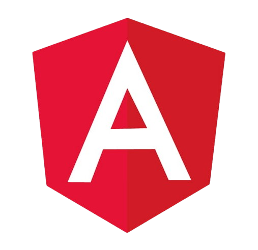
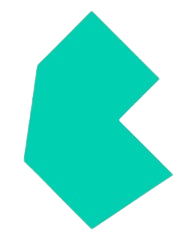
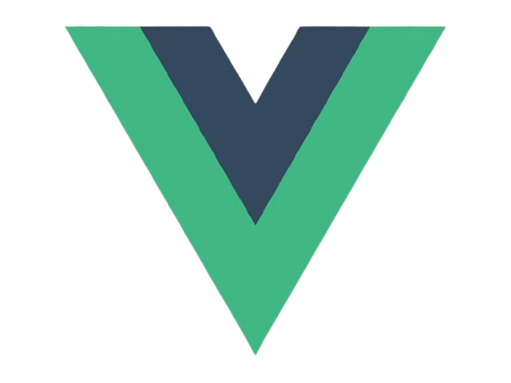
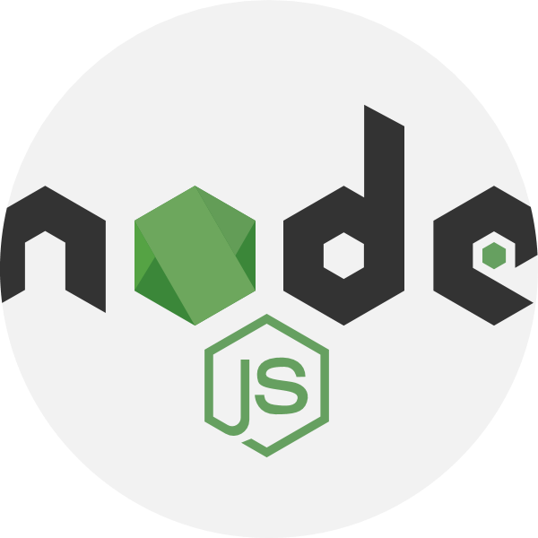
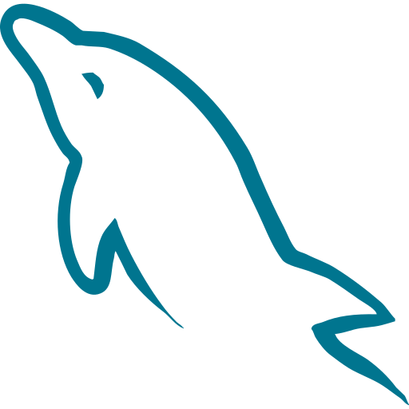
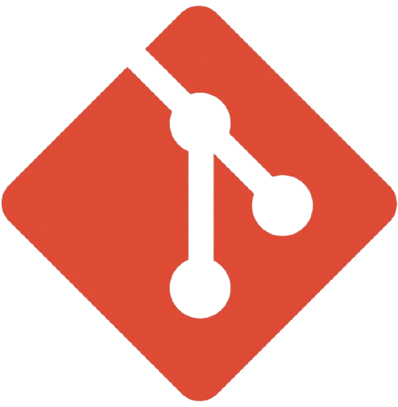
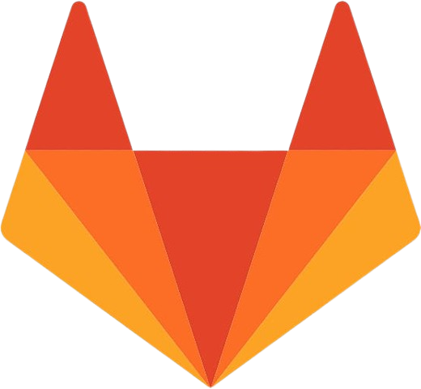

<h1 align="left">:wave: Hello there! I'm Wiyan Barkah Elmansyah</h1>
<h3 align="left">I do Software Development</h3>

  
  
  

* 🏢 I'm currently working as a **Fullstack Developer**
* 📖 Learn more about my projects on my **[portfolio](https://haloel-next.vercel.app/en)**
* 📫 Ask me anything on my **[issues page](https://github.com/WiyanEl/WiyanEl/issues)**
* 💻 Connect with me on **[LinkedIn](https://www.linkedin.com/in/wiyan-barkah-elmansyah/)**
* 📸 Connect with me on **[Instagram](https://www.instagram.com/wiyann27)**
* 🎵 Connect with me on **[TikTok](https://www.tiktok.com/@wiyanbarkah)**

<h2 align="left">Favorite Tech</h2>
<table>
  <!-- Frontend -->
  <tr>
    <td valign="middle" width="140">
      <strong>Frontend</strong>
    </td>
    <td>
      
      
      
      
      
      
      
      
      
      
    </td>
  </tr>

  <!-- Backend -->
  <tr>
    <td valign="middle" width="140">
      <strong>Backend</strong>
    </td>
    <td>
      
      
      
      
    </td>
  </tr>

  <!-- Database -->
  <tr>
    <td valign="middle" width="140">
      <strong>Database</strong>
    </td>
    <td>
      
      
      
    </td>
  </tr>

  <!-- Version Control -->
  <tr>
    <td valign="middle" width="140">
      <strong>Version Control</strong>
    </td>
    <td>
      
      
      
    </td>
  </tr>
</table>

<h2 align="left">Coding Activity</h2>

  

